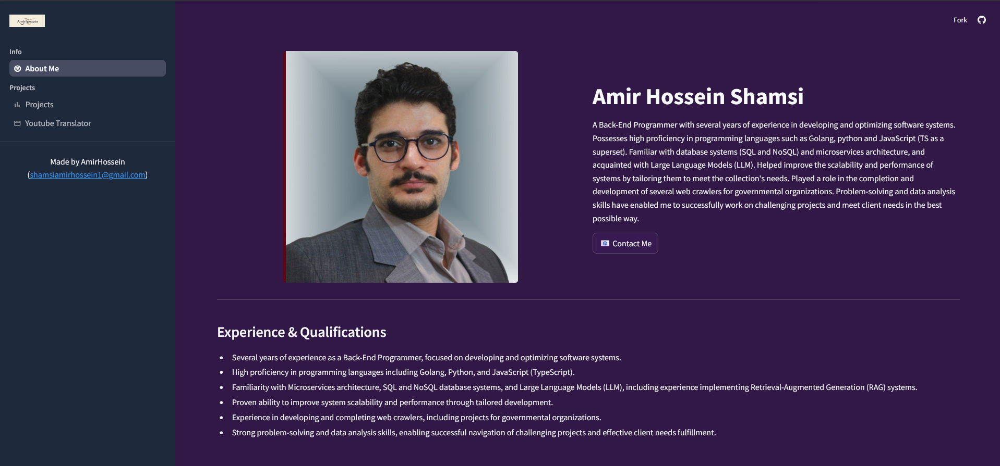

# 🧑‍💻 Amir Hossein Shamsi – Portfolio Dashboard

Welcome to my interactive **Streamlit Portfolio Dashboard**, a modern and responsive web application showcasing my skills, experience, and project work as a back-end developer.

---

## 🚀 Features

- 🌐 **Multipage Navigation** with custom sidebar layout
- 👨‍💼 **About Me**: Professional bio, skills, and qualifications
- 📦 **Projects**: Stylish cards with GitHub links & descriptions
- 🤖 **Chatbot**: Smart conversational agent (LLM-powered)
- 📬 **Contact Dialog**: Inline contact form via modal popup
- 🎨 Custom **CSS styling** for animations and beautiful UI

---

## 📂 Pages Overview

### 📄 `main.py`

- Configures multipage layout using `st.Page` API
- Loads the **About Me**, **Projects**, and **Chat Bot** pages
- Includes a custom **sidebar footer** with contact info
- Sets up page title, favicon, and layout styling

### 👤 `about_me.py`

- Displays your **profile image**, name, and biography
- Highlights:
  - Backend focus: Golang, Python, TypeScript
  - LLM & microservices experience
  - Projects for government organizations
- Features a **"Contact Me"** button that opens a modal form
- Lists:
  - ✅ Experience & Qualifications
  - 🛠️ Technical Skills

### 📊 `projects.py`

- Renders a grid of your personal and open-source projects
- Each card includes:
  - Project title, description, tech used
  - GitHub link
  - (Optional) Live demo button
- Uses **custom CSS** for hover effects, buttons, and layout
- Includes a footer section with links to GitHub and more

---

## 🛠 Tech Stack

- **Streamlit** – Multipage, dialogs, layouts
- **Plotly**, **Pandas** – Data interaction and plotting
- **LangChain**, **Groq API** – LLM Chatbot
- **PyMuPDF**, **FFmpeg**, **PyQt** – Backend tools in projects
- **CSS** – Custom UI styling (hover, animations, theming)

---

## 📸 Screenshots

---

## 📫 Contact

Made by **Amir Hossein Shamsi**  
📧 [shamsiamirhossein1@gmail.com](mailto:shamsiamirhossein1@gmail.com)  
🌐 [GitHub](https://github.com/Amir-Hossein-shamsi) • [LinkedIn](#) • [Website](#)

---

> ⭐ Feel free to clone this repo, explore the projects, or reach out for collaboration opportunities!
